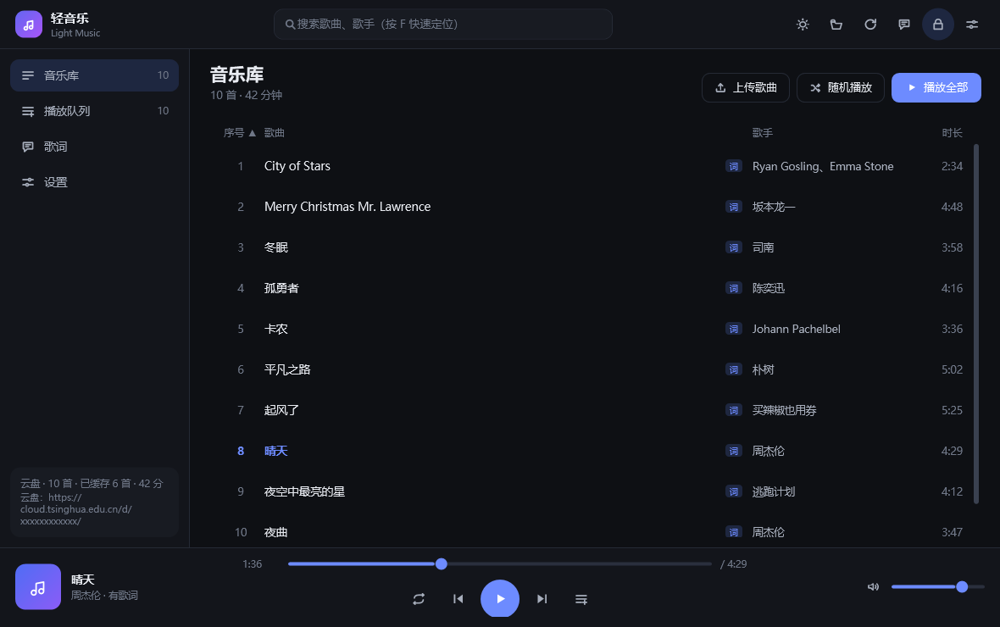
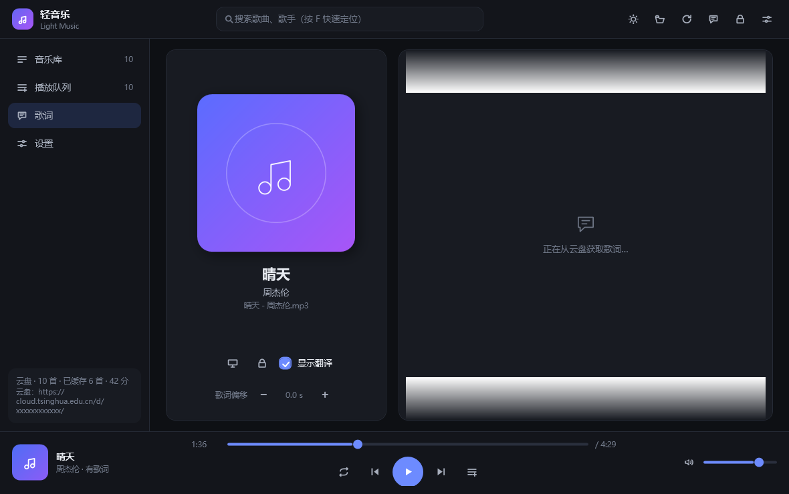
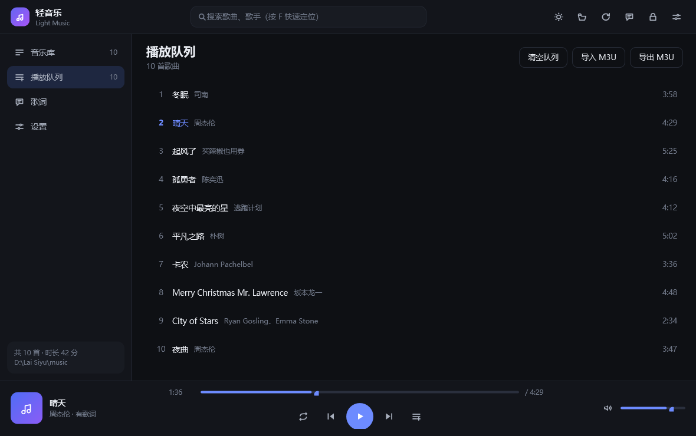
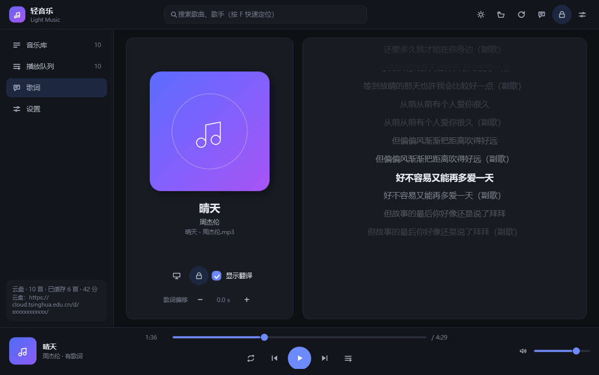
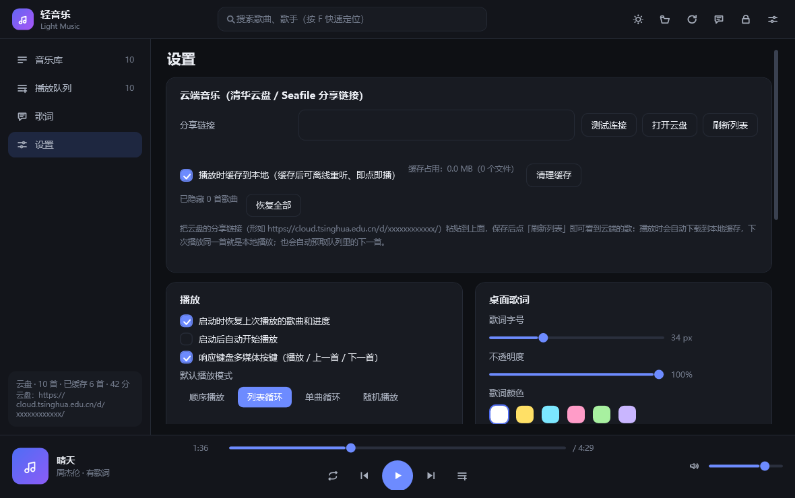
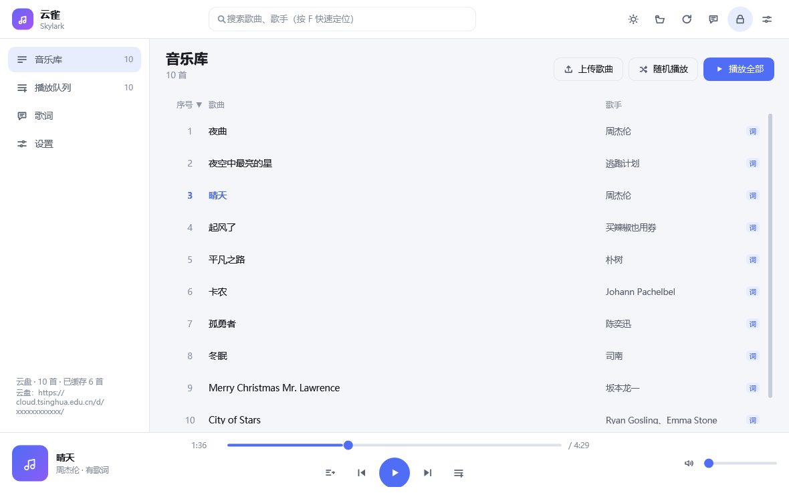

# 轻音乐 (Light Music)

[](https://github.com/G336ncx-bjx/light-music-player/actions/workflows/ci.yml)
[](https://github.com/G336ncx-bjx/light-music-player/releases)

一个轻量、顺手的 **云端音乐播放器**：**单个 exe、零依赖**，双击桌面快捷方式就能听歌。

音乐与歌词放在你自己的**云盘分享文件夹**里（默认按清华云盘 / Seafile 分享链接读取），
播放时自动下载到本地缓存，下次播放同一首就是本地播放；程序不上传任何数据、不扫描系统里的其它内容。



## 下载

不想自己编译的话，直接到 [Releases](https://github.com/G336ncx-bjx/light-music-player/releases) 下载：

- `LightMusic.exe`：单文件绿色版，下载后双击即可运行（Windows 10 / 11）。
- `LightMusic-win-x64.zip`：exe + 使用说明的压缩包。

下载后如果想让桌面有个快捷方式，运行 `scripts\install.ps1`（或手动给 exe 发送快捷方式到桌面）即可。

## 功能

- **歌曲列表**：读取云盘分享文件夹，按「歌名 - 歌手.mp3」解析歌名与歌手（支持一位或多位歌手）。
  - **单击歌名 = 播放这一首并加入播放列表**（已在列表里不会重复添加）；
  - 顶部有「上传歌曲 / 随机播放 / 播放全部」，右键还有「下一首播放 / 从列表移除」等操作；
  - 支持搜索，以及按序号 / 歌曲 / 歌手 / 时长排序。
- **上传到云盘**：点「上传歌曲」选择文件，或把歌曲 / 歌词文件、整个文件夹**直接拖进窗口**即可上传到分享目录；上传进度显示在左下角，完成后自动刷新列表。
- **播放控制**：播放 / 暂停、上一首 / 下一首、进度拖动、音量调节、静音。
- **播放模式**：顺序播放、列表循环、单曲循环、随机播放。
- **播放列表（播放队列）**：单击队列里的歌曲即刻播放；每行右侧的 **✕** 把这一首移出队列，右键还能上移 / 下移 / 下一首播放；支持清空、导入导出 M3U。
- **歌词**：
  - 软件内歌词页：逐行高亮、自动滚动、点哪句跳哪句、支持翻译行（同一时间戳的第二行）、歌词偏移微调。
  - **桌面歌词**：独立置顶浮窗，可拖动、可调字号 / 颜色 / 不透明度；**支持锁定（鼠标穿透）**，锁定后完全不影响点击和操作电脑。
- **云端缓存**：播放时按需下载到本地缓存，可关闭（播完即删）或一键清理；自动预取播放列表里的下一首，切歌更顺。
- **主题**：**跟随系统（默认）** / 深色 / 浅色，系统切换深浅色时自动跟随。
- **其它**：全局多媒体按键、托盘图标、记忆播放进度与窗口位置、单实例运行。

## 快速开始

```powershell
# 1) 构建（用 Windows 自带的 .NET Framework 编译器，不需要安装任何依赖）
powershell -ExecutionPolicy Bypass -File build.ps1

# 2) 构建 + 创建桌面快捷方式 + 启动
powershell -ExecutionPolicy Bypass -File scripts\install.ps1 -Start
```

之后点击桌面上的「轻音乐」即可运行。程序是单文件 `dist\LightMusic.exe`（约 200 KB），可以直接复制到任何 Windows 10 / 11 电脑上运行。

### 音乐与歌词的放置（在云盘里）

```
云盘分享文件夹/
├─ 冬眠 - 司南.mp3
├─ 冬眠 - 司南.lrc          ← 歌词与歌曲同名，放在同一个目录
├─ City of Stars - Ryan Gosling、Emma Stone.mp3
└─ City of Stars - Ryan Gosling、Emma Stone.lrc
```

- 歌名与歌手用 ` - `（空格 连字符 空格）分隔，多歌手可用 `、` `,` `&` `/` 分隔。
- 有歌词时会自动关联；歌词支持 UTF-8 / UTF-16 / GBK 编码，支持 `[offset:±毫秒]` 与「同一时间戳的第二行作为翻译」。
- 在「设置 → 云端音乐」里粘贴分享链接（形如 `https://cloud.tsinghua.edu.cn/d/xxxxxxxxxxxx/`），点「刷新列表」即可。

### 两种连接方式

| 方式 | 能做什么 | 怎么拿 |
| --- | --- | --- |
| **分享链接**（默认） | 列目录、播放、上传 | 网页版里对文件夹「分享」生成的链接 |
| **资料库 API 令牌** | 上面全部 + **删除云端文件**、上传覆盖同名文件，且不依赖分享链接 | 网页版打开资料库 → 设置 → API 令牌 → 新建（权限选读写） |

两种都填在「设置 → 云端音乐」里，填了令牌就优先用令牌。**令牌等同密码**，只保存在本机设置里，请不要公开或提交到仓库；
不想用了可以在网页版里删掉这个令牌。

只填其中一个即可：只填令牌（分享链接留空）同样能列目录、播放、上传、删除，界面上也只会显示资料库名称而不会显示令牌明文。

## 桌面歌词


三种状态，互不干扰：

| 状态 | 外观 | 鼠标 |
| --- | --- | --- |
| **已锁定** | 完全透明，只有带阴影的文字（无底色、无边框） | 整窗鼠标穿透，点击直接落到下面的窗口 |
| **未锁定 · 鼠标不在上面** | 透明 | 不挡操作 |
| **未锁定 · 鼠标移上去** | 出现半透明底与阴影，右上角浮出小工具栏 | 可拖动、可点工具栏 |


- 右上角工具栏（鼠标移上去才会出现）：**锁定 / 解锁**、字号减、字号加、回到主界面、关闭。
  锁定时整窗鼠标穿透，其余按钮隐藏，只在**鼠标靠近时**在右上角浮出一个 **「解锁」小按钮**（移开后自动淡出），所以**锁定状态下依然能用鼠标一键解锁**。
- 外语歌：当前句有译文时，只显示这一句的原文 + 译文（同样字号，上下两行）；没有译文时才显示下一句作预览。
- 打开 / 隐藏：主界面顶栏的歌词按钮，快捷键 `D`，或全局快捷键 `Ctrl+Alt+D`。
- 锁定 / 解锁：工具栏上的锁按钮、主界面顶栏的锁形按钮、设置里的开关，或全局快捷键 `Ctrl+Alt+L`。
- 颜色可以直接在桌面歌词上**右键 → 歌词颜色**切换（含白色 / 黑色 / 深灰等 10 个预设与自定义取色器），字号、不透明度、翻译开关在「设置 → 桌面歌词」里调整。
- 锁定后不会出现在 Alt+Tab 里，也不会抢焦点；位置与样式自动记忆。

## 快捷键

| 按键 | 作用 |
| --- | --- |
| `空格` | 播放 / 暂停 |
| `←` `→` | 快退 / 快进 5 秒 |
| `Ctrl + ←` / `Ctrl + →` | 上一首 / 下一首 |
| `↑` `↓` | 音量加减 |
| `F` | 定位到搜索框 |
| `L` / `Q` / `D` | 歌词页 / 播放队列 / 桌面歌词 |
| `M` | 静音 |
| `Ctrl + Alt + L` | 锁定 / 解锁桌面歌词（全局） |
| `Ctrl + Alt + D` | 显示 / 隐藏桌面歌词（全局） |
| 多媒体键 | 播放 / 暂停、上一首、下一首（全局，可在设置里关闭） |

## 界面

| 歌词页 | 播放队列 |
| --- | --- |
|  |  |

| 长歌词自动滚动 | 设置（双列布局） |
| --- | --- |
|  |  |

| 浅色主题 | 桌面歌词（锁定：无背景、鼠标穿透） |
| --- | --- |
|  |  |

## 项目结构

```
build.ps1                    构建脚本（调用系统自带 csc.exe，把 XAML 作为资源内嵌进 exe）
scripts/make-icon.ps1        生成多尺寸应用图标（纯 System.Drawing 绘制）
scripts/install.ps1          构建 + 创建桌面 / 开始菜单快捷方式
src/Program.cs               入口：单实例、自检与截图模式
src/MainWindow.cs            主窗口：外壳、播放调度、托盘、全局热键、设置持久化
src/LibraryView.cs           音乐库视图（列表 / 排序 / 右键菜单）
src/QueueView.cs             播放队列视图（增删排序 / M3U 导入导出）
src/LyricsView.cs            软件内歌词页（逐行高亮 + 平滑滚动）
src/SettingsView.cs          设置页
src/DesktopLyricsWindow.cs   桌面歌词浮窗（置顶 / 拖动 / 鼠标穿透锁定）
src/PlayerEngine.cs          基于 WPF MediaPlayer 的播放内核（含平滑进度估算）
src/Services.cs              目录探测、LRC 解析、时长解析、扫描、配置、M3U
src/Models.cs                数据模型与设置项
src/Theme.cs                 配色、矢量图标、控件工厂
src/Resources/theme.xaml     控件样式（按钮 / 列表 / 滚动条 / 滑块 / 菜单…）
src/Resources/templates.xaml 列表行数据模板
```

### 一些实现细节

- **零依赖**：直接使用 Windows 自带的 .NET Framework 4.x 与 WPF，用 `csc.exe` 编译，产物是单个 exe，不需要安装 .NET SDK 或任何第三方库。
- **快速扫描**：时长不依赖解码器，直接解析文件头（MP3 支持 Xing/VBRI 帧数、FLAC 的 STREAMINFO、WAV、M4A/MP4 的 mvhd），并按时长 + 修改时间做缓存。
- **歌词解析**：自动识别 UTF-8 / UTF-16 / GBK，支持一行多时间戳、`offset` 偏移与翻译行。
- **播放进度**：MediaPlayer 的位置更新较粗糙，这里用锚点 + 秒表插值，让进度条与歌词滚动更平滑。
- **配置位置**：`%APPDATA%\LightMusic\settings.json`（该目录不可写时自动退回 exe 同级 `data` 目录）。

### 开发用命令

```powershell
# 无界面自检：歌词解析、文件名解析、时长解析、真实播放、扫描、配置、M3U
dist\LightMusic.exe --selftest

# 离屏渲染界面截图，便于检查排版（library / lyrics / queue / settings / desktop）
dist\LightMusic.exe --shot out.png lyrics dark

# 真实启动界面 5 秒后自动退出（冒烟测试）
dist\LightMusic.exe --smoke

# 验证桌面歌词“锁定”是否真的鼠标穿透（用 WindowFromPoint 做命中测试）
dist\LightMusic.exe --lockcheck

# 把本地文件夹里的歌一次性补齐到云端（缺的上传、同名同大小跳过、大小不同覆盖）
dist\LightMusic.exe --uploadall <令牌或分享链接> "D:\某个文件夹"

# 整库校验：逐首拉文件头解析时长 + 统计歌词覆盖率
dist\LightMusic.exe --cloudtest <令牌或分享链接>
```

## 许可证

[MIT](LICENSE)

## 版本与发布约定

- 只有**功能级改动**（用户能感知的新能力或修复）才会打 `v*` 标签并发布 Release；
- 工具类、内部重构、命令行的改动只推送到 `main`（CI 依旧会构建 + 跑自检），版本号保持不变；
- 主版本号只在出现不兼容变更时提升，尽量保持「一个版本对应一次有意义的交付」。
